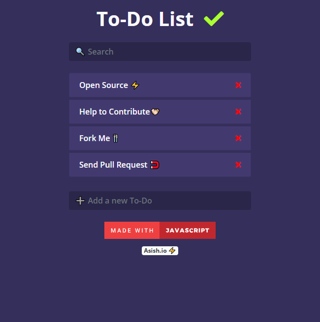

# ToDo JS ✔ 
### Check it out [here]!
    

## Overview 👀

- A simple To-Do list web app to keep a track of things you gotta do
- This web app makes no request to external/backend servers for storing data but instead stores data on local machines
- Fully responsive site

## WIP 🛠
- Adding edit functionality
- Adding gesture events
- Mobile APP 

## How To Contribute🤝 
- Yes,it is open source you can clone and change code to your need.
- Most of the code is self explanatory, anyhow
- for any clarification on code or want to contribute contact 
- [Gmail] / [Twitter] /[LinkedIn]

[Gmail]: <mailto:vashish888@gmail.com>
[LinkedIn]: <https://www.linkedin.com/in/asish-raju-7a0b90192>
[Twitter]: <https://twitter.com/vashish888>

 
 [here]:<https://asishraju.github.io/ToDo-JS/>
